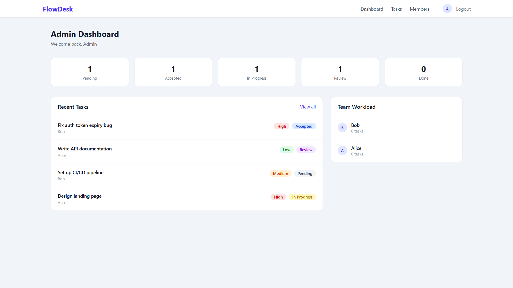

# FlowDesk — MEAN Stack Task Manager


A full-stack task assignment and workflow app built with the MEAN stack. Admins create tasks, assign them to team members, and track progress through a **Pending → Accepted → In Progress → Review → Done** workflow.



---

## Features

- **Role-Based Access** — Admin manages tasks and team; Members view assigned tasks and update status
- **JWT Authentication** — register, login, persistent sessions via localStorage
- **Task Management** — create, edit, delete, and assign tasks with priority and due date
- **Workflow Statuses** — Pending → Accepted → In Progress → Review → Done
- **Activity Log** — track every status change per task
- **Team Workload** — admin dashboard shows task distribution across members
- **Priority Labels** — Low / Medium / High with colour-coded badges
- **Protected Routes** — auth and admin guards on sensitive pages
- **Responsive UI** — Tailwind CSS 4, works on desktop and mobile

---

## Tech Stack

| Layer | Technology |
|---|---|
| Frontend | Angular 19.x, TypeScript 5.x, Tailwind CSS 4.x |
| HTTP Client | Angular HttpClient |
| Backend | Node.js 22+, Express 5.x, TypeScript 5.x |
| Database | MongoDB, Mongoose 9.x |
| Auth | JWT 9.x, bcryptjs 3.x |
| Dev Tools | ts-node-dev, concurrently |

---

## Project Structure

```
├── server/                  # Express API
│   ├── src/
│   │   ├── controllers/     # Route handlers (auth, user, task, activity)
│   │   ├── middleware/      # JWT auth + admin role guard
│   │   ├── models/          # Mongoose schemas (User, Task, Activity)
│   │   ├── routes/          # API route definitions
│   │   ├── types/           # TypeScript type definitions
│   │   └── seed.ts          # Demo data seeder
│   ├── .env.example
│   └── package.json
│
├── client/                  # Angular frontend
│   ├── src/
│   │   ├── app/
│   │   │   ├── core/        # Models, services, interceptors, guards
│   │   │   ├── shared/      # Badge, Avatar, Modal components
│   │   │   └── pages/       # Auth, Dashboard, Tasks, Members
│   │   ├── environments/    # Dev and prod environment configs
│   │   ├── index.html       # Angular entry HTML
│   │   └── styles.css       # Tailwind CSS entry point
│   ├── .postcssrc.json
│   ├── proxy.conf.json
│   ├── tsconfig.json
│   └── package.json
│
├── docs/images/             # Screenshots
├── docker-compose.yml       # MongoDB via Docker
└── README.md
```

---

## Getting Started

### Prerequisites

- [Node.js v20+ (tested on v24.13.0)](https://nodejs.org)
- [Docker](https://www.docker.com) — for MongoDB (or MongoDB installed locally)

### 1. Clone the repository

```bash
git clone https://github.com/saadshahidit/flow-desk.git
cd flow-desk
```

---

### 2. Set up environment variables

**server/.env:**

```env
MONGO_URI=mongodb://localhost:27017/flow-desk
JWT_SECRET=your_long_random_secret_here
PORT=5000
NODE_ENV=development
```

### 3. Start MongoDB

**Option A — Docker (recommended):**

```bash
docker compose up -d
```

**Option B — Local MongoDB:** Make sure MongoDB is running locally or use a [MongoDB Atlas](https://www.mongodb.com/cloud/atlas) connection string in `server/.env`.

### 4. Install dependencies and start

```bash
# Server
cd server
npm install
npm run dev

# Client (new terminal)
cd client
npm install
ng serve
```

### 5. Seed demo data (optional)

```bash
cd server && npm run seed
```

| Email | Password | Role |
|---|---|---|
| admin@flowdesk.com | password123 | admin |
| alice@flowdesk.com | password123 | member |
| bob@flowdesk.com | password123 | member |

Open `http://localhost:4200` in your browser.

---

## API Reference

### Auth — `/api/auth`

| Method | Endpoint | Description |
|---|---|---|
| POST | `/register` | Register a new user |
| POST | `/login` | Login and receive a JWT |
| GET | `/me` | Get current user (auth required) |

### Users — `/api/users` (admin required)

| Method | Endpoint | Description |
|---|---|---|
| GET | `/` | List all team members |
| PATCH | `/:id/role` | Change member role |
| DELETE | `/:id` | Remove a user |

### Tasks — `/api/tasks` (auth required)

| Method | Endpoint | Description |
|---|---|---|
| GET | `/` | Admin: all tasks — Member: assigned only |
| POST | `/` | Create a new task (admin) |
| GET | `/:id` | Get task detail |
| PUT | `/:id` | Edit task details (admin) |
| PATCH | `/:id/assign` | Assign task to a member (admin) |
| PATCH | `/:id/status` | Update task status |
| DELETE | `/:id` | Delete a task (admin) |

### Activity — `/api/activity` (auth required)

| Method | Endpoint | Description |
|---|---|---|
| GET | `/task/:taskId` | Get activity log for a task |

---

## Deployment

| Part | Platform |
|---|---|
| Frontend | [Vercel](https://vercel.com) |
| Backend | [Render](https://render.com) |
| Database | [MongoDB Atlas](https://www.mongodb.com/cloud/atlas) |

When deploying, set the environment variables on each platform:
- On Render: set `MONGO_URI`, `JWT_SECRET`, `PORT`, `NODE_ENV`
- On Vercel: configure `apiUrl` in `environment.prod.ts` to your live Render backend URL

---

## License

MIT
